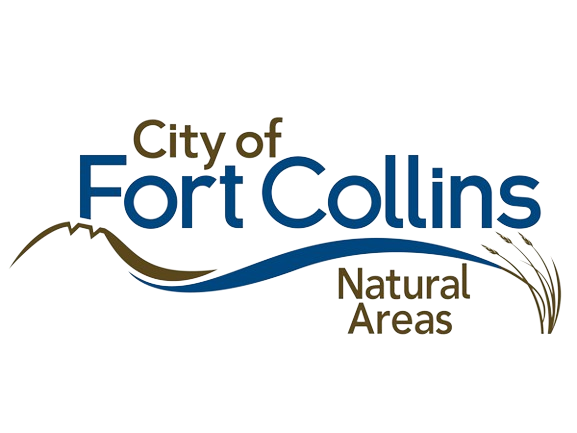

  
  <h1>FloraFoco</h1>
   
  FloraFoco is a website developed with the desire to make it easier for people to view the native plants of Fort Collins. FloraFoco offers an aesthetically pleasing way to view detailed information about Fort Collins' native plants. Whether your looking for general plant information (i.e. plant height, scientific name, etc), you can find it on FloraFoco!

 

 
<h1>Access ⚙️</h1>

If you have the desire to view the FloraFoco website, just visit [florafoco.github.io](florafoco.github.io).

⚠️ ***Note:*** a custom domain for this website is coming soon!

 

  <h1>Thanks to our Supporters! 🙏</h1>
  

